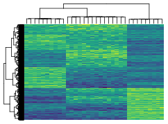

```{r, include=FALSE}
knitr::opts_chunk$set(
  results = 'asis', 
  echo = FALSE
)

library(glue)
library(tidyverse)
library(googlesheets4)

# ======================================================================
# These variables determine how the the data is loaded and how the exports are
# done.

# Is data stored in google sheets? If no data will be gather from the csvs/
# folder in project
using_googlesheets <- TRUE

# Just the copied URL from the sheet
positions_sheet_loc <-  
  glue("https://docs.google.com/spreadsheets/d/",  
       "1-M-8hma20SSN51BiFkoIsSrakF2oDxwwnN-mbGYoztg/edit?usp=sharing")

# Is this sheet available for anyone to read? If you're using a private sheet
# set this to false and go to gather_data.R and run the data loading manually
# once to cache authentication
sheet_is_publicly_readable <- TRUE

# Is the goal of this knit to build a document that is exported to PDF? If so
# set this to true to have links turned into footnotes at the end of the
# document+
PDF_EXPORT <- FALSE # don't want to sanitize links
PDF <- FALSE # but want the text to be equivalent to the version ;)

# Is this a resume or CV? 
RESUME <- TRUE

# A global (gasp) variable that holds all the links that were inserted for
# placement at the end
links <- c()

# ======================================================================
# Now we source two external scripts. One contains functions for building the
# text output and the other loads up our data from either googlesheets or csvs

# Functions for building sections from CSV data
source('scripts/parsing_functions.R') 

# Load data for CV/Resume
source('scripts/gather_data.R')

# Now we just need to filter down the position data to include less verbose
# categories and only the entries we have designated for the resume
if (RESUME) {
  position_data <- 
    position_data %>% 
    filter(in_resume)
  # set doc to resume, to refer to resume pdf and html
  doc <- "resume"
} else {
  # set doc to cv, to refer to resume pdf and html
  doc <- "cv"
}
# Location of PDF
CV_PDF_LOC <- glue("https://github.com/kzkedzierska/cv/raw/main/pdfs/",
                   "kzkedzierska_{doc}.pdf")
# Location of the website
CV_HTML_LOC <- glue("kasia.codes/{doc}/")
```

<!-- taken from https://github.com/nstrayer/cv/issues/24 -->
```{css, echo = FALSE}
.pagedjs_page:not(:first-of-type) {
  --sidebar-width: 0.01rem;
  --sidebar-background-color: var(--timberwolf);
  --main-width: calc(var(--content-width) - var(--sidebar-width));
  --decorator-horizontal-margin: 0.2in;
}
```

Aside
================================================================================
<br>
<br>
<!--  -->
<!-- {width=100%} -->

```{r}
# When in export mode the little dots are unaligned, so fix that. 
if(PDF){
  glue("View this Resume online </br> <i class='fas fa-globe'></i> [{CV_HTML_LOC}](https://{CV_HTML_LOC})")
} else {
  glue("[<i class='fas fa-download'></i> Download a PDF of this CV]({CV_PDF_LOC})")
}
```

Contact {#contact}
--------------------------------------------------------------------------------

```{r}
contact_info %>% 
  glue_data("- <i class='fa fa-{icon}'></i> {contact}")
```


Coding Skills {#skills}
--------------------------------------------------------------------------------

```{r}
programming %>%
  arrange(-level) %>%
  build_skill_bars() 
```

{#ml-skills}
--------------------------------------------------------------------------------

R: `tidyverse`, `data.table`, `Shiny`, `plotly`, `tidymodels`, `caret` and others  
Python: `NumPy`, `Pandas`, `SciPy`, `scikit-learn`, `keras`, `PyTorch`, `Seaborn`, `matplotlib` and more

Languages {#skills}
--------------------------------------------------------------------------------

```{r}
languages %>%
  arrange(-level) %>%
  build_skill_bars() 
```

  
    
Disclaimer {#disclaimer}
--------------------------------------------------------------------------------

[CV source code](https://github.com/kzkedzierska/cv). Made with [pagedown](https://github.com/rstudio/pagedown), based on [nstrayer/cv](https://github.com/nstrayer/cv). 

Last updated on `r Sys.Date()`.

Main
================================================================================

Kasia Kedzierska {#title}
--------------------------------------------------------------------------------

```{r}
text_blocks %>% 
  print_text_block('intro')
```


Selected Work Experience {data-icon=laptop}
--------------------------------------------------------------------------------

```{r}
position_data %>%
  print_section_concise_swe('research_positions')
```

Education {data-icon=graduation-cap data-concise=true} 
--------------------------------------------------------------------------------
```{r}
#.page-break-before}
```

```{r}
position_data %>%
  print_section_concise_swe('education')
```

Selected Awards and Honors {data-icon=award}
--------------------------------------------------------------------------------

```{r}
position_data %>%
  print_section('awards_and_honours')
```


Attended Workshops, Summer Schools {data-icon=user-graduate} 
--------------------------------------------------------------------------------

```{r}
# .page-break-before}
position_data %>%
  print_section('summer_schools')
```


Selected Publications {data-icon=book data-concise=true .page-break-before}
--------------------------------------------------------------------------------

Full list of publication is available through my Google Scholar profile [scholar.google.com/citations?user=Yv6poTwAAAAJ](https://scholar.google.com/citations?user=Yv6poTwAAAAJ&hl=en).

```{r}
position_data %>%
  print_section_concise_pubs('academic_articles')
```


Selected Conference Presentations {data-icon=comment-dots data-concise=true}
--------------------------------------------------------------------------------

```{r}
position_data %>%
  print_section_concise_talks('conferences')
```

Teaching Experience {data-icon=chalkboard-teacher}
--------------------------------------------------------------------------------
<!-- :::aside -->
<!-- ```{r} -->
<!-- # .page-break-before} -->
<!-- text_blocks %>%  -->
<!--   print_text_block('teaching_experience_aside') -->
<!-- ``` -->
<!-- ::: -->

```{r}
position_data %>%
  print_section_concise('teaching_positions')
```


Selected Grants {data-icon=euro-sign}
--------------------------------------------------------------------------------

```{r}
position_data %>%
  print_section_concise('grants')
```

Non-profit Work {data-icon=handshake}
--------------------------------------------------------------------------------

```{r}
position_data %>%
  dplyr::filter(in_resume) %>%
  print_section_concise('ngo') 
```
